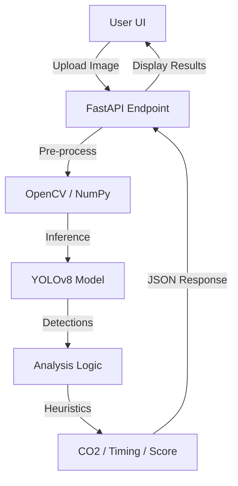

# 🚦 Traffic AI Analyzer

A sophisticated full-stack application that leverages computer vision to analyze traffic patterns from images. It provides real-time insights into vehicle density, environmental impact, and intelligent traffic management.

## 🌟 Overview

Traffic AI Analyzer uses the **YOLOv8** (You Only Look Once) architecture to detect and classify vehicles. It doesn't just count cars; it computes environmental metrics and optimizes traffic flow parameters based on real-world density data.

---

## 🧠 How It Works: The Internal Logic

The "brain" of the system resides in `app/model.py`. Here's a deep dive into the processing pipeline:

### 1. Object Detection (YOLOv8)
The system uses the `yolov8m.pt` (medium) model, which strikes a balance between speed and precision. 
- **Classes Detected:** Car (ID 2), Motorcycle (ID 3), Bus (ID 5), Truck (ID 7).
- **Inference Parameters:** Confidence threshold of `0.15` and image size of `1024px` for high-resolution analysis.

### 2. CO₂ Emission Estimation
Each vehicle class is assigned a specific CO₂ emission rate (estimated grams per minute idling/slow movement):
- **Car:** 69 g/min
- **Motorcycle:** 15 g/min
- **Bus:** 350 g/min
- **Truck:** 400 g/min

**Formula:** `Total CO₂ = Σ (Count_of_Class * Rate_of_Class)`

### 3. Dynamic Green Signal Timing
Instead of fixed timers, the system suggests signal durations based on current density.
- **Base time:** 3 seconds.
- **Factor:** 2.5 seconds per detected vehicle.
- **Range:** Minimum 15s, Maximum 120s.

**Formula:** `Time = clamp(15, 120, 3 + (Total_Vehicles * 2.5))`

### 4. Energy Score & Congestion Status
- **Energy Score:** Starts at 100% and decreases by 4% for every vehicle detected, representing the efficiency of the intersection (lower vehicles = higher efficiency).
- **System Status:**
    - `0 vehicles`: **CLEAR**
    - `1-5 vehicles`: **NORMAL**
    - `6-15 vehicles`: **MODERATE**
    - `>15 vehicles`: **CONGESTED**

---

## 🛠 Tech Stack

- **Frontend:** HTML5, CSS3 (Vanilla), JavaScript (ES6+).
- **Backend:** FastAPI (Python), OpenCV, NumPy.
- **AI Model:** Ultralytics YOLOv8.

---

## 📐 Architecture & Data Flow



---

## 🚀 Getting Started

### Prerequisites
- Python 3.9+
- pip (Python package manager)

### Installation

1. **Clone the project**
   ```bash
   git clone <repository-url>
   cd TrafficAIAnalyzer
   ```

2. **Setup Environment**
   ```bash
   python -m venv venv
   source venv/bin/activate  # Windows: venv\Scripts\activate
   ```

3. **Install Dependencies**
   ```bash
   pip install -r app/requirements.txt
   ```

4. **Run Server**
   ```bash
   uvicorn app.main:app --reload
   ```

---

## 📂 Project Structure

```text
TrafficAIAnalyzer/
├── app/
│   ├── main.py      # API routing & Static serving
│   ├── model.py     # AI Logic & Logic Heuristics
│   ├── index.html   # Dashboard Structure
│   ├── static/      # CSS & JS assets
│   │   ├── style.css
│   │   └── app.js
│   └── requirements.txt # Python packages
├── yolov8m.pt       # Pre-trained Model Weights
└── Procfile         # Railway Deployment Config
```

---

*Developed as part of the TrafficAI Initiative.* 🛣️
